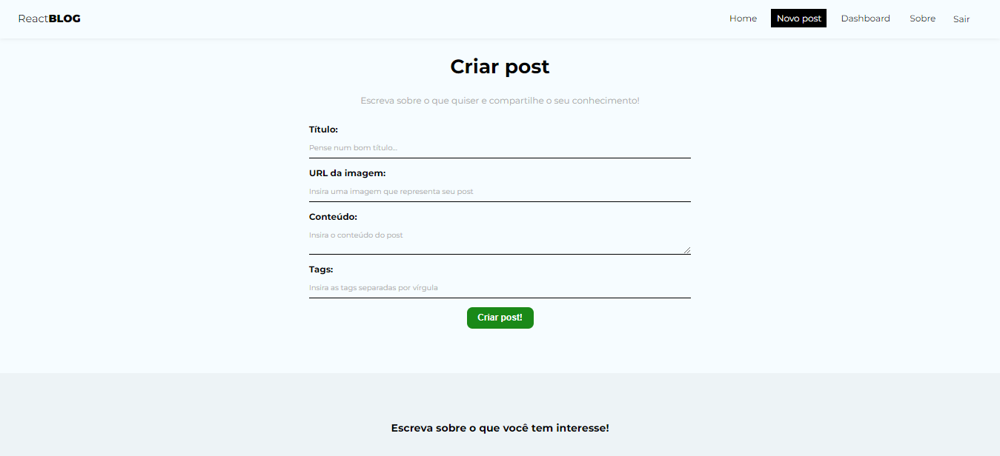
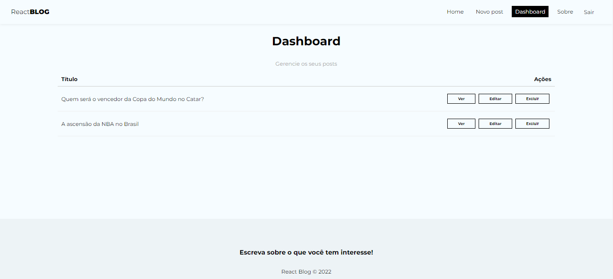
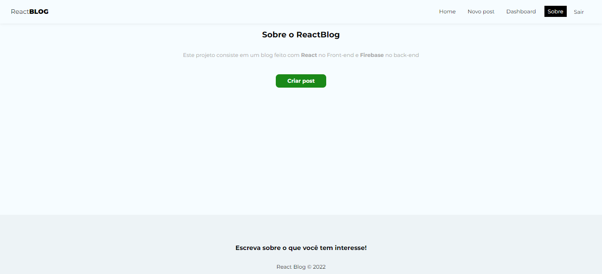
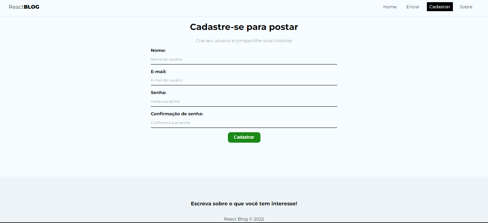
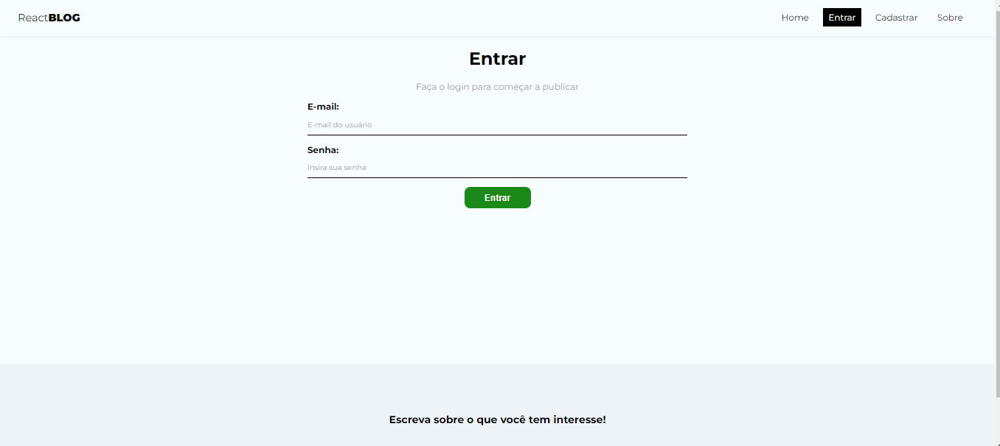

# React Blog

Um blog feito com React no front-end e Firebase no back-end

## Screenshots

**Página inicial**

**Criar novo post**

**Dashboard do usuário**

**Página de edição do post**

**Sobre**

**Cadastro de novo usuário**

**Login**

## Aprendizados

React Router, Hooks, Context, Firebase, Authentication 

## Stack utilizada

**Front-end:** React, Styled Components

**Back-End:** Firebase

## Autores

Made with 🧡 by: 

- [@orvinicius](https://www.github.com/orvinicius)

